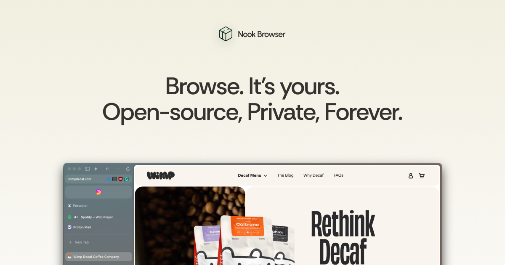

# Nook Browser — Waitlist & Changelog

[](https://nook-www-preview.vercel.app)
[](https://discord.gg/2gX69DuWwX)
[](https://nook-www-preview.vercel.app/roadmap)


A minimal, cozy landing page/changelog for the Nook Browser with a Sanity-powered changelog and a GitHub-backed roadmap.



## Quick start

```bash
pnpm i        # or npm i / yarn
pnpm dev      # start dev server
pnpm build    # build for production
pnpm preview  # preview production build
```

## Environment

Create `.env` (or set in your host):

```env
PUBLIC_SANITY_PROJECT_ID=your_sanity_project_id
PUBLIC_SANITY_DATASET=production
```

## Links

- Site: https://browsewithnook.com
- Discord: https://discord.gg/2gX69DuWwX
